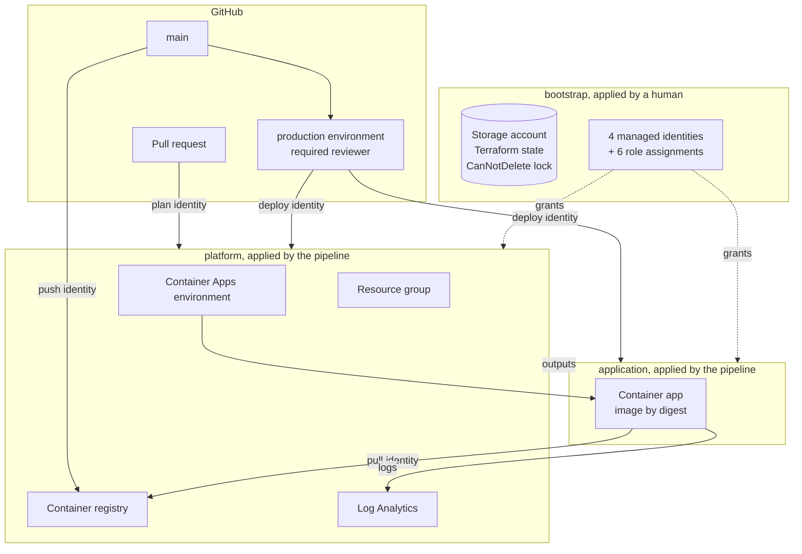
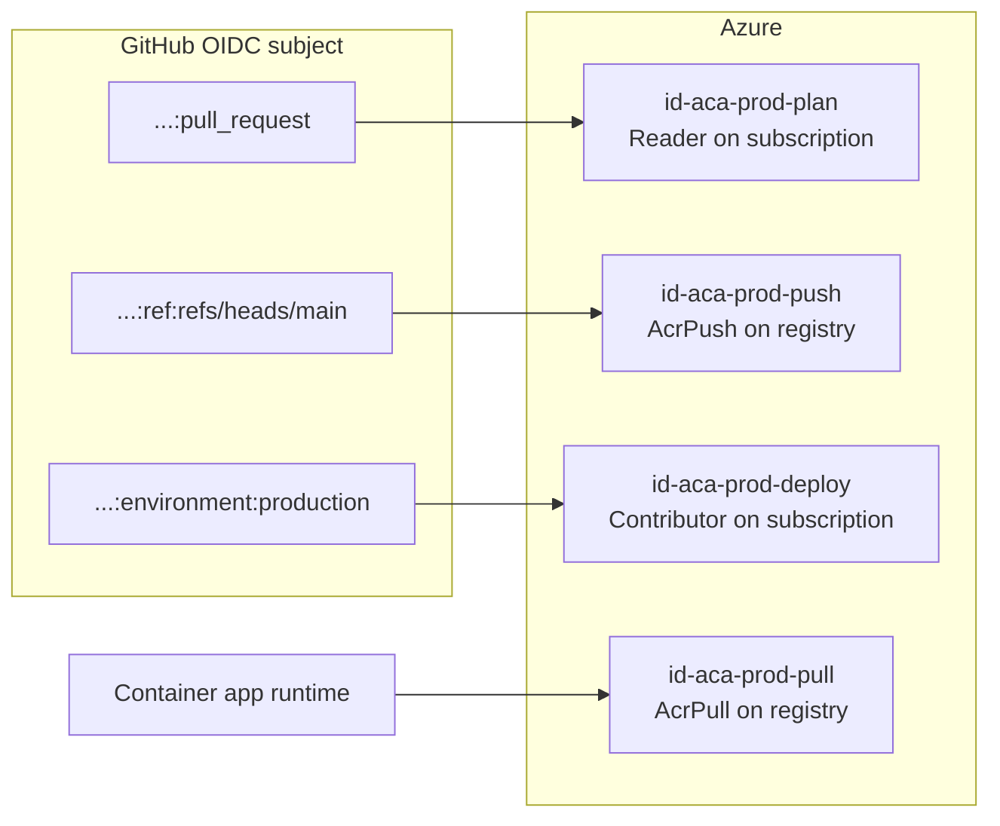
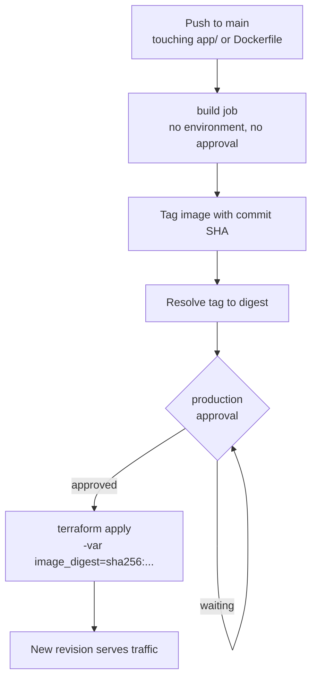

# The architecture actually running

What this repository deploys, why each boundary exists, and how each piece maps
onto the Kubernetes concepts in `.architecture/kubernetes.md`.

Everything here is read from the Terraform in this repository, not from memory.

---

## 1. The whole thing at a glance

Three Terraform states, split by **how often each changes** and **who is
permitted to apply it**. That second half is the load-bearing decision.

**The central rule: the pipeline holds Contributor and cannot create role
assignments.** Every identity and grant lives in `bootstrap`, which only a human
applies. The pipeline can therefore delete everything it manages, but cannot
give itself, or anything else, new permissions.

That asymmetry is deliberate. Destruction is loud and rebuildable from code. A
quietly granted permission persists and nobody notices.

---

## 2. Why three states

| State | Owns | Applied by | Changes |
|---|---|---|---|
| `bootstrap` | State backend, 4 identities, 6 role assignments, delete lock | A human, locally | Almost never |
| `platform` | Resource group, registry, Log Analytics, Container Apps environment | Pipeline, gated | Rarely |
| `application` | The container app, ingress, scaling | Pipeline, gated | Every release |

A single state was rejected for a concrete reason: the registry must exist
before an image can be pushed into it, so the first apply and the first build
become tangled. Splitting also means a release plan does not display pending
infrastructure drift, which is how reviewers learn to skim plans.

**Outputs are the interface.** The application state reads the platform's
outputs through `terraform_remote_state`, so the dependency is visible rather
than implied.

One deliberate exception: the application resolves the image-pull identity by
**name** rather than reading bootstrap's state. Reading that state would expose
every bootstrap output, including the other three identities, to a stack that
needs one.

---

## 3. The four identities

Each authenticates through GitHub OIDC and is trusted on **exactly one**
subject. No cloud secret exists anywhere.

| Identity | Trusted on | Can | Cannot |
|---|---|---|---|
| `plan` | `:pull_request` | Read the subscription, lock state | Change anything |
| `push` | `:ref:refs/heads/main` | Push images | Deploy. It holds no subscription role |
| `deploy` | `:environment:production` | Manage resources | Create role assignments |
| `pull` | runtime only, no federation | Pull images | Anything else |

**Why push is federated on the branch, not the environment.** Pushing an image
changes nothing that serves traffic; it adds an artifact no running revision
references. The deployment is what changes where users land, so the approval
gate belongs there. Gating the build too would add no safety and would train a
reviewer to approve twice without reading either.

**Why the pull identity is user-assigned.** A system-assigned identity does not
exist until the container app exists, and by then nothing can grant it `AcrPull`
because only the pipeline deploys the app and the pipeline cannot create role
assignments. The cycle has no solution, so the identity is created ahead of the
app.

---

## 4. The release path

**The image is deployed by digest, never by tag.** A tag is a mutable pointer
and can be moved to a different artifact; a digest names one exact artifact. The
commit SHA tag exists only as a lookup key. If an image already exists for the
commit, the build is skipped and the same digest resolves, so a Terraform-only
change produces no pointless new revision.

`/version` reports the commit its image was built from, which is how a running
replica can be asked what it is rather than assumed.

---

## 5. Mapping to Kubernetes

Azure Container Apps runs on Kubernetes with KEDA, Dapr and Envoy. Nearly every
concept in `.architecture/kubernetes.md` has a counterpart here, usually one you
do not have to operate.

| This setup | Kubernetes equivalent | Who runs it |
|---|---|---|
| Container Apps environment | The cluster itself | Azure |
| Container app | `Deployment` + `Service` + `Ingress` | You declare, Azure runs |
| Revision | `ReplicaSet` | Azure |
| `min_replicas: 0`, `max_replicas: 3` | HPA, plus **KEDA** for scale to zero | Azure |
| Liveness / readiness probes | Identical concept, identical semantics | You |
| `cpu: 0.25`, `memory: 0.5Gi` | Requests and limits | You |
| Ingress with `external_enabled` | `Ingress` or Gateway API + cloud LB | Azure |
| User-assigned identity for pull | ServiceAccount + workload identity federation | You declare |
| Log Analytics workspace | Cluster logging stack | Azure |
| Registry with admin disabled | Same registry, same digest discipline | You |

### What Azure operates that you would otherwise own

The entire control plane: apiserver, etcd and its quorum, scheduler, controller
manager, node pool, upgrades, CNI, CoreDNS, kube-proxy or its eBPF replacement,
and the ingress controller.

Concretely, that removes etcd backups and restore drills, control-plane HA
across failure domains, node patching, three minor upgrades a year, and CNI
choice.

### What this setup genuinely does not have

Being straight about the gaps rather than implying parity:

- **No NetworkPolicy equivalent.** Decision 0005 records that the environment
  has no VNet, so there is no network segmentation to configure. Acceptable for
  one public stateless service with no private dependency; not acceptable the
  moment a database appears.
- **No PodDisruptionBudget.** Azure handles voluntary disruption during platform
  maintenance, and it is not something you tune.
- **No StatefulSet, no persistent volumes.** The service is stateless by design.
  Position is arithmetic, so there is no database.
- **Single environment.** Decision 0001 cites promoting a build between
  environments as a motivation for the three-state split, and only production
  exists.
- **`revision_mode` is `Single`.** No traffic splitting, no canary, despite
  decision 0001 citing it.

---

## 6. What is deliberately absent, and why

| Absent | Reason |
|---|---|
| VNet, private endpoints | Public stateless service, no private dependency. A VNet would cost money and block a hosted runner from smoke-testing the app |
| Database | Position is computed arithmetically. No state to store, so every replica agrees |
| Premium registry | Justified by private endpoints, geo-replication or measured throughput. None apply |
| Secrets in the app | It has none. No API keys, no connection strings |

Each is recorded in `docs/decisions/` with the conditions that would reverse it.
Absence with a recorded trigger is a decision; absence without one is an
oversight.

---

## 7. Where the guarantees actually come from

Worth separating what is enforced from what is merely intended:

| Guarantee | Enforced by |
|---|---|
| Pipeline cannot widen permissions | Azure RBAC. Contributor excludes role assignment writes |
| A PR cannot deploy | The federated credential trusts one subject. Azure refuses the token |
| A PR cannot even read the deploy identity | `AZURE_DEPLOY_CLIENT_ID` is scoped to the `production` environment |
| Only exact artifacts reach production | `image_digest` validated against `^sha256:[0-9a-f]{64}$` |
| Plan output cannot leak the subscription ID | Subscription ID is a **secret**, so masked in logs; workflows hold no `pull-requests: write` |
| Nothing reaches main unreviewed | Branch protection: PR required, linear history, `enforce_admins` |

The last column is the point. None of these rely on an agent, or a person,
remembering.
