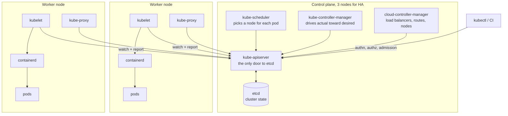
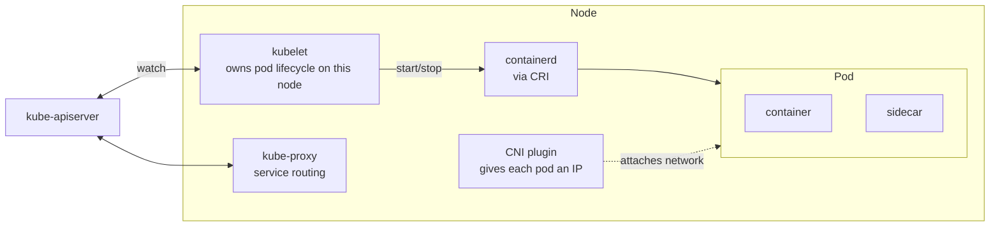
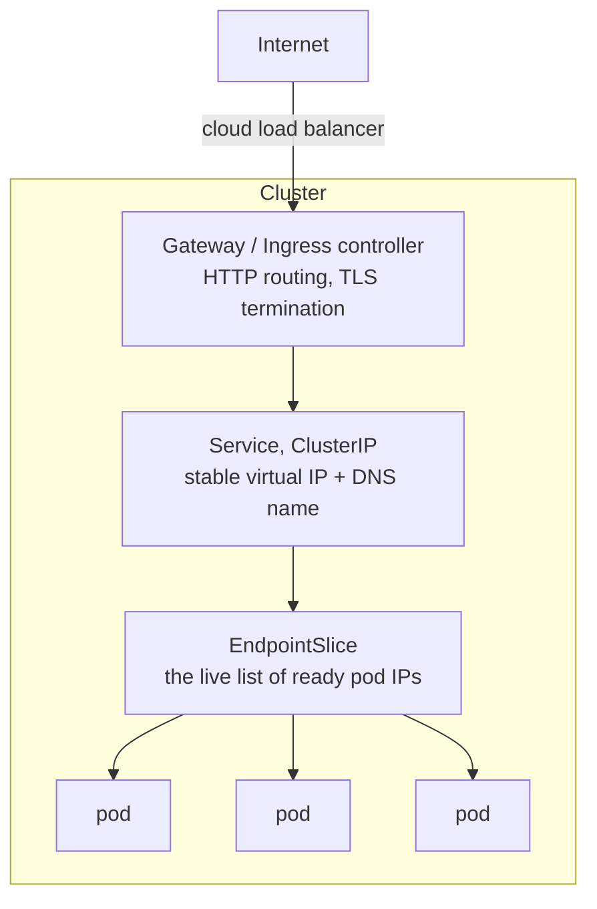
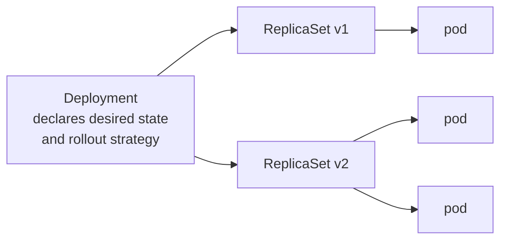
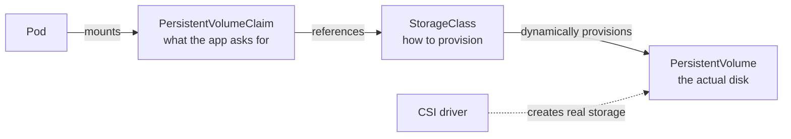

# What a solid Kubernetes cluster looks like

A reference for learning. Every claim here is about upstream Kubernetes unless a
managed service is named.

Version notes matter in Kubernetes more than in most systems, because things are
genuinely removed. Anything marked **removed** below will not work on a current
cluster no matter what an older tutorial says.

---

## 1. The whole thing at a glance

Kubernetes splits into a **control plane** that decides what should be true, and
**nodes** that make it true. Nothing else in the diagram talks to `etcd`. That
single fact explains most of the design.

**The control loop is the whole idea.** You write desired state to the API
server. Controllers watch for a gap between desired and actual, and act to close
it. Nothing is imperative. If you delete a pod that a Deployment owns, a
controller notices the gap and creates another one. You did not "fail to delete
it"; you briefly widened a gap the system then closed.

---

## 2. Control plane, component by component

| Component | Responsibility | If it stops |
|---|---|---|
| `kube-apiserver` | Validates and persists every change. Handles authn, authz, admission | Nothing can change. Running pods keep running |
| `etcd` | The only durable store. Key-value, strongly consistent | Cluster loses its memory. This is the thing to back up |
| `kube-scheduler` | Assigns pending pods to nodes by fit and policy | New pods stay `Pending`. Existing pods unaffected |
| `kube-controller-manager` | Runs built-in controllers: Deployment, ReplicaSet, Node, Job | Drift stops being corrected |
| `cloud-controller-manager` | Talks to the cloud API for load balancers, routes, node lifecycle | `LoadBalancer` services stay `Pending` |

**The apiserver is stateless.** Run three of them behind a load balancer and
scale freely. All the hard state lives in etcd.

### Why etcd counts are always odd

etcd uses Raft, which needs a **quorum** of more than half the members to accept
a write.

| Members | Quorum | Failures tolerated |
|---|---|---|
| 1 | 1 | 0 |
| 3 | 2 | **1** |
| 4 | 3 | **1** |
| 5 | 3 | **2** |

Four members tolerate exactly as many failures as three, while giving you one
more thing that can break. That is why you never see a four-member etcd. Three
is the normal answer, five for large or critical clusters, and beyond that write
latency suffers because every write must reach a majority.

**etcd is the backup target.** Losing every worker node is recoverable. Losing
etcd without a snapshot means rebuilding the cluster's entire state by hand.

---

## 3. The node

**kubelet** is the agent. It watches the apiserver for pods assigned to its
node, tells the runtime to start them, runs probes, and reports status back. It
does not decide *what* should run.

**The container runtime is containerd or CRI-O.** Docker as a runtime was
**removed in v1.24**. Images built by Docker still work everywhere, because the
image format is an OCI standard and was never the issue. Only the runtime shim
went away.

**A pod is the smallest deployable unit**, not a container. Containers in a pod
share a network namespace, which is why a sidecar reaches the main container on
`localhost`, and share the pod's lifetime and volumes. Two containers belong in
one pod only when they genuinely cannot be scheduled apart.

---

## 4. Networking

Kubernetes mandates a flat model: **every pod gets its own IP, and every pod can
reach every other pod without NAT.** The CNI plugin implements that. Cilium,
Calico and the cloud-native plugins all satisfy the same contract differently.

Pod IPs are ephemeral. A pod that restarts gets a new IP, so nothing addresses
pods directly. That is what Services are for.

### Service types

| Type | What it does | Use |
|---|---|---|
| `ClusterIP` | Stable virtual IP, cluster-internal only. **The default** | Almost everything |
| `NodePort` | Opens the same high port on every node | Rarely, mostly a building block |
| `LoadBalancer` | Asks the cloud for an external load balancer | One per exposed service, which gets expensive |
| `ExternalName` | Returns a DNS CNAME, no proxying | Pointing at something outside the cluster |

**A Service is not a process.** It is a rule. `kube-proxy` programs iptables or
IPVS on every node so that traffic to the virtual IP is rewritten to a real pod
IP. Newer eBPF dataplanes such as Cilium replace `kube-proxy` entirely and do
the same job in the kernel with better scaling.

**EndpointSlice is where readiness bites.** A pod only appears there once its
readiness probe passes, which is precisely how a rolling update avoids sending
traffic to a container that is still starting.

### Ingress and its successor

`Ingress` is the old HTTP entry point and is **feature-frozen**. The **Gateway
API** is its replacement: richer routing, and a clean split between the
platform team owning `Gateway` and app teams owning `HTTPRoute`. New clusters
should prefer Gateway API; plenty of production clusters still run Ingress and
that is fine.

### NetworkPolicy

**Pod networking is allow-all by default.** Any pod can reach any pod. A
`NetworkPolicy` selects pods and, once any policy selects a pod, everything not
explicitly allowed to that pod is denied.

A solid cluster starts with a **default-deny** policy per namespace and opens
paths deliberately. Note that NetworkPolicy is enforced by the CNI plugin, so a
cluster running a plugin that ignores it will accept your YAML and enforce
nothing. That is a genuinely dangerous silent failure worth checking for.

---

## 5. Workloads

A **Deployment** owns **ReplicaSets**, and a ReplicaSet owns **pods**. A rollout
creates a new ReplicaSet and shifts replicas across, which is why a rollback is
instant: the old ReplicaSet still exists at zero replicas.

| Object | For |
|---|---|
| `Deployment` | Stateless services. Interchangeable replicas |
| `StatefulSet` | Stable identity and storage per replica. Databases, quorum systems |
| `DaemonSet` | Exactly one pod per node. Log shippers, CNI agents, node exporters |
| `Job` / `CronJob` | Run to completion, once or on a schedule |

**StatefulSet is not "Deployment for stateful things".** It gives each pod a
stable ordinal name and its own persistent volume that survives rescheduling.
Reach for it only when identity actually matters.

### Probes

Three probes, and confusing them causes real outages:

- **`startupProbe`**, "has it finished booting?" While it runs, the other two
  are suspended. This is the correct fix for a slow starter, not a long
  `initialDelaySeconds` on the liveness probe.
- **`readinessProbe`**, "should it receive traffic?" Failing removes the pod
  from EndpointSlice. **It does not restart anything.**
- **`livenessProbe`**, "is it wedged?" Failing **kills and restarts** the
  container.

The classic self-inflicted outage: a liveness probe that hits a dependency. The
dependency slows down, every replica fails liveness at once, and the whole
service restart-loops over a problem that was never in your code.

### Requests, limits, and QoS

**Requests** drive scheduling; **limits** cap runtime. They behave very
differently by resource:

- **CPU is compressible.** Exceeding the limit throttles the container. Slow,
  not fatal.
- **Memory is not.** Exceeding the limit is an immediate **OOMKill**.

| QoS class | Condition | Evicted |
|---|---|---|
| `Guaranteed` | limits == requests, for every container | Last |
| `Burstable` | requests set, limits higher or absent | Middle |
| `BestEffort` | nothing set | **First** |

Pods with no requests are evicted first under node pressure. Setting requests is
not optional in a serious cluster.

---

## 6. Storage

The app writes a **PVC** saying "10Gi, ReadWriteOnce". A **StorageClass**
describes how to satisfy that, and a **CSI driver** does the work.

Access modes are the trap. `ReadWriteOnce` means one **node**, not one pod, and
most cloud block storage supports only that. Wanting many pods across many nodes
to share a volume means a file-based backend such as NFS or Azure Files.

Note `reclaimPolicy`: `Delete` removes the real disk when the PVC goes;
`Retain` keeps it. A `Delete` StorageClass on a database is a data-loss incident
one `kubectl delete` away.

---

## 7. Scaling

Three separate mechanisms that people frequently conflate:

| Mechanism | Changes | Reacts to |
|---|---|---|
| **HPA** | Number of pods | CPU, memory, or custom metrics |
| **VPA** | Requests/limits of pods | Observed usage over time |
| **Cluster Autoscaler** | Number of **nodes** | Pods stuck `Pending` |

HPA and Cluster Autoscaler compose naturally: HPA adds pods, pods do not fit,
the autoscaler adds a node. **HPA and VPA fight** if both target CPU on the same
workload, because one scales out while the other scales up on the same signal.

**KEDA** extends HPA to event sources such as queue depth, and enables genuine
**scale to zero**, which plain HPA cannot do. Worth knowing because Azure
Container Apps is built on it.

---

## 8. Security

This is where "solid" is mostly decided.

### RBAC

Four objects, and the split confuses everyone once:

| Object | Scope |
|---|---|
| `Role` | Permissions **within one namespace** |
| `ClusterRole` | Permissions cluster-wide, or on non-namespaced things |
| `RoleBinding` | Grants a Role **or a ClusterRole** inside one namespace |
| `ClusterRoleBinding` | Grants a ClusterRole **everywhere** |

The useful subtlety: a `RoleBinding` can reference a `ClusterRole`. That is how
you define a permission set once and grant it namespace by namespace.

RBAC is **purely additive**. There is no deny rule. If a subject has a
permission from any binding, it has it.

### ServiceAccounts and workload identity

Every pod runs as a ServiceAccount, defaulting to `default` in its namespace,
which should have no permissions. Modern tokens are short-lived and audience-
bound, projected into the pod.

For cloud access, **federate rather than store keys**. The pod's ServiceAccount
token is exchanged for a cloud credential, scoped to one identity. This is the
same OIDC federation pattern used in this repository's GitHub Actions setup, and
it is the reason there is no cloud secret to leak.

### Pod Security Admission

**PodSecurityPolicy was removed in v1.25.** The replacement is **Pod Security
Admission**, a built-in controller applying three levels per namespace via
labels:

- `privileged`: no restrictions
- `baseline`: blocks known privilege escalations
- `restricted`: hardened, non-root, no privilege escalation, seccomp, dropped
  capabilities

Each level runs in `enforce`, `audit` or `warn` mode. Label namespaces
`restricted` and exempt deliberately.

### Secrets

Kubernetes Secrets are **base64-encoded, not encrypted**, in etcd by default.
Base64 is an encoding, not a protection. Real handling means at least
`EncryptionConfiguration` for encryption at rest, and preferably an external
store (Key Vault, Secrets Manager) mounted through the Secrets Store CSI driver
so the secret never persists in etcd at all.

### Supply chain

Deploy by **digest, not tag**. A tag is a mutable pointer; `:latest` on two
nodes can be two different images. A digest names one exact artifact. Pair with
signing and an admission controller that rejects unsigned images.

---

## 9. What makes it "solid"

A checklist worth actually holding a cluster to:

**Availability**
- Control plane across 3 nodes, etcd 3 or 5, spread over failure domains
- Workers across multiple availability zones
- `PodDisruptionBudget` on every real service. It protects against **voluntary**
  disruption such as node drains, and does nothing for a crash
- `topologySpreadConstraints` so replicas do not all land in one zone

**Correctness**
- Requests and limits on every container
- All three probes used for what they mean
- No `:latest`, ever

**Security**
- Namespace-level `restricted` Pod Security Admission
- Default-deny NetworkPolicy, verified the CNI actually enforces it
- RBAC least privilege, no wildcard ClusterRoleBindings
- Secrets encrypted at rest or held externally
- Federated cloud identity, no long-lived keys

**Operability**
- etcd backups, and a **restore that has been practised**
- Metrics, logs and traces leaving the cluster
- Everything in version control, applied by a pipeline, not by `kubectl apply`
  from a laptop

---

## 10. Honest trade-offs

Kubernetes is not free. Worth being clear-eyed:

- **It is a platform for building platforms.** For a single stateless web
  service, a managed container runtime does the same job with a fraction of the
  concepts. See `.architecture/current.md` for exactly that comparison.
- **The failure modes are subtle.** A NetworkPolicy silently unenforced, a
  liveness probe amplifying an outage, a `Delete` reclaim policy on a database.
  None of these announce themselves.
- **Upgrades are ongoing work.** Roughly three minor releases a year, each
  supported about fourteen months, and APIs do get removed.

The reason to learn it anyway is that it is the vocabulary the industry uses,
and most managed container platforms are Kubernetes underneath with the sharp
edges covered.

---

## Reading order

If this is your first pass, the highest return is:

1. The control loop in section 1
2. Pods and probes in sections 3 and 5
3. Services and EndpointSlice in section 4
4. RBAC in section 8

Storage, scaling and Gateway API keep until you need them.
